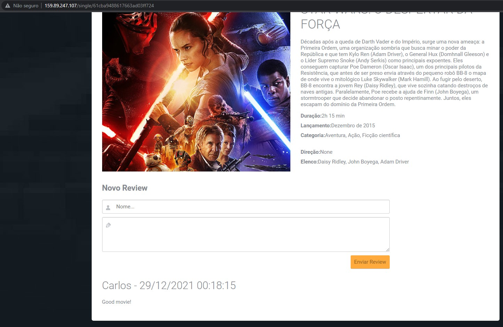

# DXXR Test

This repository is divided in three main parts.
- `do-k8scluster.tf`: Terraform to create the Kubernetes Cluster on DigitalOcean (Cloud Provider);
- `src/rottenpotatoes-web`: Web python application used as example to be deployed in the cluster ([source link](https://github.com/KubeDev/rotten-potatoes));
- `charts/rottenpotatoes`: Application's Helm chart, contains deployment for the web app and its database (mongodb).

All development and tests were done on Ubuntu 20.04

> If you already have this repository downloaded, a kubernetes cluster configured and the application pushed to a container image registry, just jump to **Step 4** to install the Helm chart.

## Requeriments
- [Docker](https://docs.docker.com/get-docker/);
- [Kubectl](https://kubernetes.io/docs/tasks/tools/#kubectl);
- [Terraform](https://learn.hashicorp.com/tutorials/terraform/install-cli);
- [Helm](https://helm.sh/docs/intro/install/);
- DigitalOcean account and a [API token](https://docs.digitalocean.com/reference/api/api-reference/#section/Introduction/Curl-Examples) with READ/WRITE access.

___
# Setting up the environment
## 1. **Downloading the repository:**

```
$ wget https://github.com/carlos2beserra/dxxr-test/archive/refs/heads/main.zip
$ unzip dxxr-test-main.zip
$ cd dxxr-test-main/
```


## 2. **Running Terraform code:**
The default terraform file from this repository is configured to deploy a kubernetes cluster named **k8sdxxr** on DigitalOcean region **nyc3** using **1.21.5-do.0** kubernetes version and **3 worker nodes** to the cluster.
First, run the following terrafom commands to download providers and validate and plan the infraestructure provisioning.

```
$ terraform init
$ terraform apply
```

You'll be promped by this message. Here you need to put the DigitalOcean API Token, then press enter.
```
var.do_token     
  Enter a value: <PUT THE TOKEN HERE>
```

After Terraform calculated all the modifications, you'll be prompted to accept the planned modifications and perform the actions.
```
Do you want to perform these actions?
  Terraform will perform the actions described above.
  Only 'yes' will be accepted to approve.

  Enter a value: <WRITE YES>
```
The Kubernetes cluster deployment will take about 10 minutes to complete.
After completing, Terraform CLI will show _"Apply complete!"_ message and how many resources did it changed.

You can get the created cluster's kubeconfig by using this command.
```
$ terraform output kubeconfig | awk '/EOT/{found=0} {if(found) print} /-EOT/{found=1}' > ~/.kube/config
```

## 3. **Building and pushing the docker image:**
The folder `src/rottenpotatoes-web` has the files from our application. It's a python web application that shows a movie catalog. Inside the folder, it already has a Dockerfile to build the docker image. It's just necessary to run some commands.
First, it's necessary to login into docker to push the image to a public repository.

```
$ docker login
```

Next step is to build the docker image and tagging it. We are going to tag it using our docker username and a repository name to it and a 1.0 tag.
```
$ docker build src/rottenpotatoes-web/ -t 2blume/rottenpotatoes:1.0
```

After that, just push the image to the repo
```
$ docker push 2blume/rottenpotatoes:1.0
```

## 4. **Installing the Helm Chart:**
Edit the file `charts/rottenpotatoes/values.yaml`. The main setting to be modified is the image repository and tag. In this example we are using the `2blume/rottenpotatoes` repository and `1.0` tag.

```yaml
image:
  repository: 2blume/rottenpotatoes
  pullPolicy: Always
  tag: "1.0"
```

While still in the root directory from the project, the command below is going to install the chart into the Kubernetes Cluster that is accessible from `kubectl`, and give it the name of `rottenpotatoes`.

```
$ helm install rottenpotatoes charts/rottenpotatoes/
```

Use this command to keep watching the kubernetes resources until it's all running.
> It may take some minutes to DigitalOcean to provide a External IP to `rottenpotatoes` service.
```
$ watch kubectl get all -n default
```

```
NAME                                  READY   STATUS    RESTARTS   AGE
pod/mongodb-89dddc46-vcl44            1/1     Running   0          7m28s
pod/rottenpotatoes-75d595c9f9-bdx6z   1/1     Running   0          7m28s

NAME                     TYPE           CLUSTER-IP      EXTERNAL-IP      PORT(S)        AGE
service/kubernetes       ClusterIP      10.245.0.1      <none>           443/TCP        16m
service/mongo-service    ClusterIP      10.245.191.36   <none>           27017/TCP      7m29s
service/rottenpotatoes   LoadBalancer   10.245.91.124   159.89.247.107   80:31588/TCP   7m29s

NAME                             READY   UP-TO-DATE   AVAILABLE   AGE
deployment.apps/mongodb          1/1     1            1           7m29s
deployment.apps/rottenpotatoes   1/1     1            1           7m29s

NAME                                        DESIRED   CURRENT   READY   AGE
replicaset.apps/mongodb-89dddc46            1         1         1       7m29s
replicaset.apps/rottenpotatoes-75d595c9f9   1         1         1       7m29s
```

To test the deployed application, run these commands and access the gotten address through the browser.

```
$ export SERVICE_IP=$(kubectl get svc --namespace default rottenpotatoes --template "{{ range (index .status.loadBalancer.ingress 0) }}{{.}}{{ end }}")
$ echo http://$SERVICE_IP:80
```
___

# Results
The deployed application should look like this:


It's possible to select movies from the catalog and write reviews on it. It will be saved in the database. 


So when deleting the application pod and creating another one, the data stays with the database, and it's possible to read the same comments again and add more.

```
$ kubectl delete pod rottenpotatoes-75d595c9f9-bdx6z
```

```
NAME                                  READY   STATUS    RESTARTS   AGE
pod/mongodb-89dddc46-vcl44            1/1     Running   0          11m
pod/rottenpotatoes-75d595c9f9-g2qpb   1/1     Running   0          18s

NAME                     TYPE           CLUSTER-IP      EXTERNAL-IP      PORT(S)        AGE
service/kubernetes       ClusterIP      10.245.0.1      <none>           443/TCP        20m
service/mongo-service    ClusterIP      10.245.191.36   <none>           27017/TCP      11m
service/rottenpotatoes   LoadBalancer   10.245.91.124   159.89.247.107   80:31588/TCP   11m

NAME                             READY   UP-TO-DATE   AVAILABLE   AGE
deployment.apps/mongodb          1/1     1            1           11m
deployment.apps/rottenpotatoes   1/1     1            1           11m

NAME                                        DESIRED   CURRENT   READY   AGE
replicaset.apps/mongodb-89dddc46            1         1         1       11m
replicaset.apps/rottenpotatoes-75d595c9f9   1         1         1       11m
```


